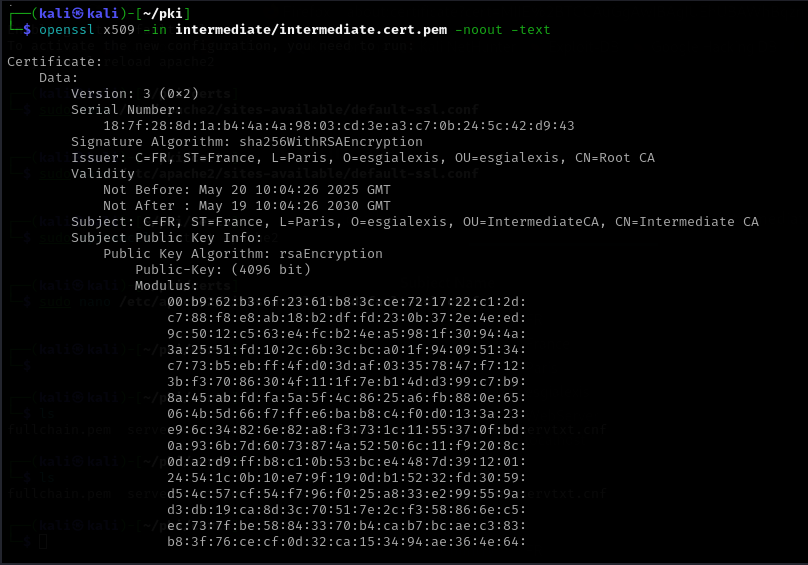

intermediate.key.pem	🔐 Clé privée de l'autorité intermédiaire	Elle permet de signer des certificats (comme celui du serveur). À protéger absolument, car elle donne le pouvoir de signer.
	

intermediate.csr.pem	📄 Demande de signature de certificat (CSR)	Ce fichier a été généré avec openssl req -new à partir de intermediate.key.pem. Il a ensuite été signé par la CA racine pour créer intermediate.cert.pem.
	

intermediate.cert.pem	📜 Certificat signé de l’autorité intermédiaire	Délivré par la CA racine. C’est l'identité publique de l’intermédiaire. Il contient sa clé publique, son sujet, sa validité, etc.
intermediate.cert.srl	

intermediate.cert.srl#️⃣ Numéro de série du dernier certificat signé	Fichier utilisé automatiquement par OpenSSL pour générer des numéros de série uniques quand l’intermédiaire signe de nouveaux certificats (ex: celui du serveur).

Certificat Ca_intermédiaire

