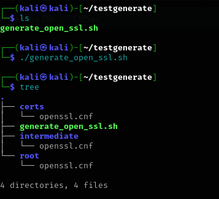
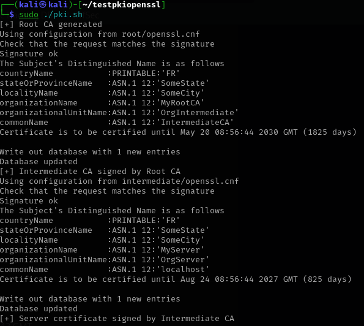

# PKi automatisé 

2 scripts :
 - generate_open_ssl.sh : généré les 3 confs openssl
 - pki.sh : Créer les certficats les signes et lance apache en https

## Lancer le script generate_open_ssl.sh 

    chmod +x generate_open_ssl.sh 
    ./generate_open_ssl.sh

Une fois le script lancé on lance le second : 

    chmod+x pki.sh
    sudo ./pki.sh

