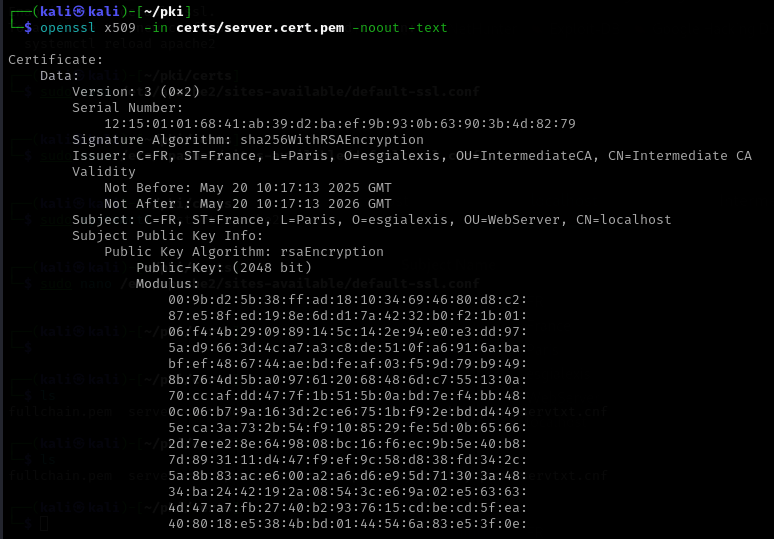

server.key.pem	🔐 Clé privée du serveur	C’est la clé privée unique du serveur HTTPS. Elle est utilisée pour déchiffrer les connexions TLS entrantes. Elle ne doit jamais être partagée.

server.csr.pem	📄 Certificate Signing Request (CSR)	C’est la demande de certificat générée avec la clé privée du serveur. Elle contient les infos d’identification (CN, etc.) et la clé publique. Elle est signée par l'AC intermédiaire.

server.cert.pem	📜 Certificat signé du serveur	C’est le certificat X.509 délivré au serveur, signé par l’autorité de certification intermédiaire. Il prouve l’identité du serveur auprès des clients.

fullchain.pem	🔗 Chaîne complète de certificats	Ce fichier est utilisé par les serveurs web (Apache/Nginx). Il contient :
 → server.cert.pem
 → intermediate.cert.pem
 → ca.cert.pem
Il permet au navigateur de valider la chaîne de confiance.

servtxt.cnf	⚙️ Fichier d’extensions pour certificat serveur	Contient les directives comme subjectAltName, keyUsage, extendedKeyUsage, etc., utilisées lors de la signature du certificat serveur pour définir ses usages.

Certificat serveur : 

